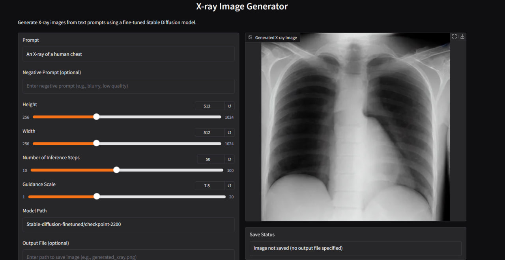

# X-Ray Text-to-Image Generation

This project explores the fascinating domain of generating **X-ray medical images from textual descriptions**, using generative models. We implement and compare three different approaches, including **GAN-based techniques** and **diffusion models**, with the most successful being **fine-tuning Stable Diffusion** on a custom dataset.

---
Here is an example of an X-ray image generated from a textual description:

  

To fully localy run this project , take the notebook , head to Colab and train the model , we made it easy for you where to start from , you will find a Header called `Fine Tunning Diffusion Model (Approach3)` start from there and download the model after it
---

## How to start (Repo Clone)

1. **Cloning the repo**:  
   Clone the project using Git:  
   `git clone https://github.com/AyaMYousef/text-to-image-generation.git`

2. Navigate into the project directory.

3. **Install dependencies**:  
   Install required Python packages:  
   `pip install -r requirements.txt`

4. Set up your environment variables by creating a `.env` file and adding your Hugging Face or relevant API keys (if needed):  

    `HF_TOKEN=your_token_here`

5. **Run the app (if Streamlit or Flask based)**:  
For Gradio gui:  
`python gui.py`  
For Fastapi:  
`python xray_inference_api.py`

---

## Docker Startup

1. A `Dockerfile` is provided to containerize the application. You can use it to build a production-ready image.

2. Build the Docker image:  
`docker build -t xraygen:v1.0 .`

3. Run the Docker container:  
`docker run -d -p 8501:8501 xraygen:v1.0`

Once the container is running, navigate to your browser at `http://localhost:8501` to access the application.

---

## Approaches Implemented

### ✅ 1. GAN-Based Image Generation
- We trained a **custom GAN** on X-ray image datasets using text embeddings as input.
- Results were limited in detail and resolution but served as a useful baseline.

### ✅ 2. Enhanced GAN (with attention / conditional GANs)
- Introduced **attention mechanisms** and **conditional input** improvements.
- Produced better structure but still lacked fidelity in fine medical details.

### ✅ 3. Stable Diffusion Fine-Tuning *(Best Results)*
- Fine-tuned the **Stable Diffusion model** on a labeled X-ray dataset.
- Achieved the **highest quality and most medically coherent results**.
- Capable of generating detailed chest, limb, or dental X-rays from precise descriptions.

---

## How to Use:

1. Once the app loads, enter a textual prompt (e.g., "Chest X-ray showing mild cardiomegaly").
2. Click “Generate” to produce an image.
3. The generated image will appear below with the option to download or save.

---

## Limitations & Future Work

- The current model is trained on limited data; larger and diverse datasets will improve generalization.
- Medical validation is pending – current outputs are **not** for diagnostic use.
- Future improvements will include interactive prompt tuning and integration with DICOM systems.

---

## Citation & Credits

- Built using PyTorch, TensorFlow, Hugging Face Diffusers, and Streamlit.
- Inspired by [Stable Diffusion](https://github.com/CompVis/stable-diffusion) and medical GAN research.

---

